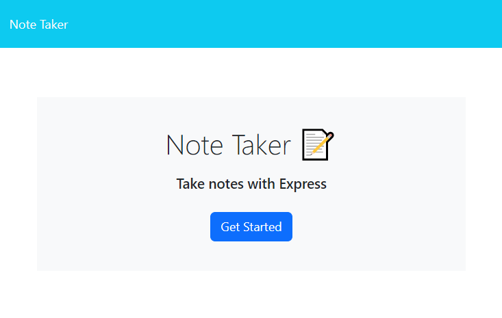
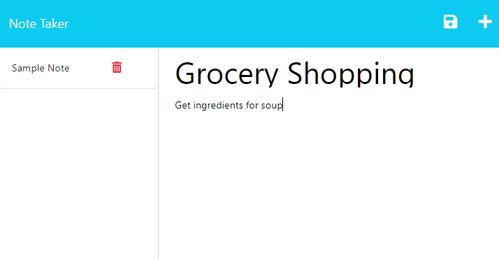

# Team Profile Generator

## Description
A simple application utilizing Express to write and save notes for daily use. Useful for organizing thoughts, keeping track of tasks, and other typical uses for a digital notepad. 

## Table of Contents 
  - [Installation](#installation)
  - [Usage](#usage)
  - [License](#license)
  - [Credits](#credits)

## Installation
The app can be run in any browser using this URL: 

## Usage
1. When the app opens, it will display the main page.
2. Click the blue "Get Started" button to initialize the app.
3. To create a new note, click the area of the app that says "Note Title" to enter the title of your note.
4. Click the area of the app that says "Note Text" to enter any details for your specific note.
5. Once you enter text into the two areas of the note, a save button will appear on the top right corner. Click the button to save the note. The saved note will appear on the left.
6. To access a previous note, click on the title of the note on the list of notes on the left.
7. If you wish to create another new note, you can click the "+" button on the top right corner.
8. To delete a specific note, click the red trash can icon next to the note you wish to delete.

## License
Please refer to the license in the repo.

## Credits
* Front end code provided by 2022 Trilogy Education Services, LLC
* Back end built by Grace Yao

